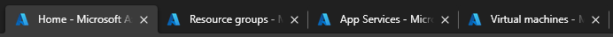
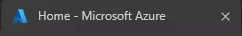
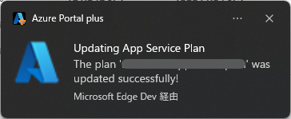
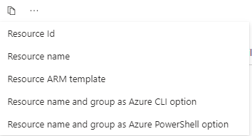

# Chrome Extension for Azure portal


This extension can add features to [Azure portal](https://portal.azure.com).  

**Note: this extension is NOT Microsoft official and `Azure` is a trademark of the Microsoft group of companies.**

https://github.com/horihiro/Azure-portal-plus-ChromeExtension/assets/4566555/89a272f3-52fc-418c-9aa2-723cfca77f53

# Features


## 1. Replace favicon to one of the resource displayed

Default state:  


This feature enabled:  


<details>
<summary>Favicon replacement rules</summary>
The favicon is replaced by the following rules.

#### Rule1
The icon of the resource group is used as the favicon of the tab, when your browser's tab is opening Azure Resource Groups or your resources in a resource group.

#### Rule2
The icon of the service is used as the favicon of the tab, when your browser's tab is opening an Azure Service (ex. `Virtual Machines`, `Storage accounts`, and so on).

> **Note**
> In case of `App Services`, the icon of `Web Apps` is used though `App Services` contains not only `Web Apps` resource but also `Function App` resource.

#### Rule3
The icon in top of the blade list (i.e. `Overview` ) is used as the favicon of the tab, when your browser's tab is opening your Azure resource.

</details>

## 2. Blink favicon during configuration


When starting a process taking long time (deploying new resouces, changing configuration of your resources or deleting your resources), the favicon of the tab is blinked until the process finishes.

## 3. Notify when finishing configuration


When finishing a process taking long time, a notification is displayed on your desktop, and the tab can be activated by clicking the notification.

## 4. Activate the portal tab when finishing configuration (Experimental)

When finishing a process taking long time, the tab opening Azure portal is activated (i.e. to be brought to the top) automatically.

## 5. Copy resouce information (v0.0.5 or later)  

Add the following copy menu to the resource page's header and disable built-in `Copy title to clipbord` in `More content actions` menu.  

> [!NOTE]
> This feature is available only for each resouce page.   
> On subscriptions, resource groups and Entra ID pages, the copy button is not shown. 



### Supported formats

  - `Resource name`  

    https://github.com/user-attachments/assets/6e4fa3a6-382a-4db0-b41e-4144c61825b9

  - `Resource Id`  
    format:  
    ```
    /subscriptions/{subscription_id}/resourceGroups/{resource_group_name}/providers/{resource_provider_name}/{resource_type}/{resource_name}
    ```

    https://github.com/user-attachments/assets/5a906a4e-c67c-45bc-9886-6c380b315b19

  - `Resource name and group as Azure CLI option`  
    format:  
    ```bash
    --name {resource_name} --resource-group {resource_group_name}
    ```

    https://github.com/user-attachments/assets/0a17aac0-8746-48e1-852e-130862e41bc4

  - `Resource name and group as Azure PowerShell option`  
    format:  
    ```pwsh
    -Name {resource_name} -ResourceGroup {resource_group_name}
    ```

    https://github.com/user-attachments/assets/2073ca02-41f2-4744-a4be-6b48fd622131

  - `Resource Template (JSON)`  
    format:  
    ```json
    {
      "name": "{resource_name}",
      "id": "/subscriptions/{subscription_id}/resourceGroups/{resource_group_name}/providers/{resource_provider_name}/{resource_type}/{resource_name}",
      "type": "{resource_provider_name}",

        :
    }
    ```

    https://github.com/user-attachments/assets/409cdd80-d188-4b96-a1c9-037c14858e3e

  - `Resource Template (Bicep)` (v0.0.8 or later)  
    NOTE: ***This feature depends on exporting function on Azure Platform.***

    <details>
    <summary>format:</summary>  

    ```yaml
    param storageAccounts_stabc123_name string = 'stabc123'

    resource storageAccounts_stabc123_name_resource 'Microsoft.Storage/storageAccounts@2024-01-01' = {
      name: storageAccounts_stabc123_name

        :
    }
    ```
    </details>
    
    https://github.com/user-attachments/assets/69bee0cf-cfef-432c-ac0b-10c9687701af

  - `Terraform (AzApi)` (v0.0.8 or later)  
    NOTE: ***This feature depends on exporting function on Azure Platform. Registering Resource Provider `Microsoft.AzureTerraform` for your subscription is required.***

    <details>
    <summary>format:</summary>  

    ```terraform
    terraform {
      required_providers {
        azapi = {
          source  = "Azure/azapi"
          version = "2.0.1"
        }
      }
    }
    provider "azapi" {}
    resource "azapi_resource" "res-0" {
      body = {
      kind = "Storage"
      properties = {
        allowBlobPublicAccess        = true
          :
    }
    ```
    </details>
    
    https://github.com/user-attachments/assets/d4b77182-528c-4991-abdb-ae6c354e48f3

  - `Terraform (AzureRM)` (v0.0.8 or later)  
    NOTE: ***This feature depends on exporting function on Azure Platform. Registering Resource Provider `Microsoft.AzureTerraform` for your subscription is required.***

    <details>
    <summary>format:</summary>  

    ```terraform
    terraform {
      required_providers {
        azurerm = {
          source  = "azurerm"
          version = "4.5.0"
        }
      }
    }
    provider "azurerm" {
      features {}
    }
    resource "azurerm_storage_account" "res-0" {
      access_tier                       = ""
      account_kind                      = "Storage"
        :
    ```
    </details>
    
    https://github.com/user-attachments/assets/7eeb8af9-189a-4e77-85ad-df6a1405f93b

  - `` VM and Bastion Ids as `az network bastion` option `` (v0.0.9 or later)  
    NOTE: ***This feature shows on Virtual Machine resource that can be connected via Azure Bastion with `Standard` / `Premium` SKU only.***

    format:  
    ```bash
    --ids {basion_resource_id} --target-resource-id {vm_resource_id}
    ```

    https://github.com/user-attachments/assets/8e0765fd-8e3e-4e9d-a7f3-55813eec0908

## 6. Restore filter string on each list view (v0.0.6 or later)  (Experimental)

By storing filter string on inputting/updating on each list view, this can restore the filter string on the list view when opening the list view again.

## 7. Open in the preview portal (v0.0.8 or later)  (Experimental)

When your resource is opened in `portal.azure.com`, you can open it in `preview.portal.azure.com` from the context menu, and vice versa.

> [!NOTE]
> To open the context menu on Azure portal, you need to use right-click with <kbd>ctrl</kbd> key.

## 8. Restore the flag for hidden resources on each list view (v0.0.10 or later)  (Experimental)

By storing the state of the flag for hidden resources on each list view, this can restore the state on the list view when opening the list view again.

## 9. Decorate resource group list depending on the number of resources included in each group (v0.0.10 or later)  (Experimental)

The font color and background color can be changed based on the number of the resources in each resource group.


The default decoration colors are:
<table>
  <thead>
    <tr>
      <th rowspan=2># of resources</th>
      <th colspan=2>light mode</th>
      <th colspan=2>dark mode</th>
    </tr>
    <tr>
      <th>font color</th>
      <th>background color</th>
      <th>font color</th>
      <th>background color</th>
    </tr>
  </thead>
  <tbody>
    <tr>
      <td>0</td>
      <td>rgb(127,127,127)</td>
      <td>rgba(223,223,223,0.7)</td>
      <td>rgb(127,127,127)</td>
      <td>rgba(32,32,32,0.7)</td>
    </tr>
    <tr>
      <td>1-2</td>
      <td>rgb(0,0,255)</td>
      <td>rgba(0,0,255,0.2)</td>
      <td>rgb(127,127,255)</td>
      <td>rgba(0,0,255,0.2)</td>
    </tr>
    <tr>
      <td>3-9</td>
      <td>rgb(0,127,0)</td>
      <td>rgba(0,255,0,0.1)</td>
      <td>rgb(63,127,63)</td>
      <td>rgba(0,255,0,0.1)</td>
    </tr>
    <tr>
      <td>10-</td>
      <td>rgb(255,0,0)</td>
      <td>rgba(255,0,0,0.1)</td>
      <td>rgb(255,127,127)</td>
      <td>rgba(255,0,0,0.1)</td>
    </tr>
  </tbody>
</table>

<details>
<summary>The CSS for the default colors is:</summary>

```css
/* for light mode */
/* for more than ten resources */
.fxs-mode-light [class^=appls-resource-count-] a { color: rgb(255,0,0); }
.fxs-mode-light [class^=appls-resource-count-] > div {background-color: rgba(255,0,0,0.1);}

/* for between three and nine resources */
.fxs-mode-light [class^=appls-resource-count-00] a {color: rgb(0,127,0);}
.fxs-mode-light [class^=appls-resource-count-00] > div {background-color: rgba(0,255,0,0.1);}

/* for one or two resources */
.fxs-mode-light .appls-resource-count-002 a,
.fxs-mode-light .appls-resource-count-001 a {color: rgb(0,0,255);}
.fxs-mode-light .appls-resource-count-002 > div,
.fxs-mode-light .appls-resource-count-001 > div {background-color: rgba(0,0,255,0.2);}

/* for no resource */
.fxs-mode-light .appls-resource-count-000 a {color: rgb(127,127,127);}
.fxs-mode-light .appls-resource-count-000 > div {background-color: rgba(223,223,223,0.7);}

/* for dark mode */
/* for more than ten resources */
.fxs-mode-dark [class^=appls-resource-count-] a { color: rgb(255,127,127); }
.fxs-mode-dark [class^=appls-resource-count-] > div {background-color: rgba(255,0,0,0.1);}

/* for between three and nine resources */
.fxs-mode-dark [class^=appls-resource-count-00] a {color: rgb(63,127,63);}
.fxs-mode-dark [class^=appls-resource-count-00] > div {background-color: rgba(0,255,0,0.1);}

/* for one or two resources */
.fxs-mode-dark .appls-resource-count-002 a,
.fxs-mode-dark .appls-resource-count-001 a {color: rgb(127,127,255);}
.fxs-mode-dark .appls-resource-count-002 > div,
.fxs-mode-dark .appls-resource-count-001 > div {background-color: rgba(0,0,255,0.2);}

/* for no resource */
.fxs-mode-dark .appls-resource-count-000 a {color: rgb(127,127,127);}
.fxs-mode-dark .appls-resource-count-000 > div {background-color: rgba(32,32,32,0.7);}
```

</details>

And you can change the style by using <a href="https://chromewebstore.google.com/search/user%20css">the User CSS extensions</a> (i.e. Stylus etc.)

- Example: Hide empty resource groups  
  https://userstyles.world/style/23821

# Try this

### From Chrome Web Store
This extension can be installed from [Chrome Web Store](https://chromewebstore.google.com/detail/azure-portal-plus/khmmpfbdpddloceabielidbdnhaokekn).

### From this repository
If you can try a development version, the following steps are needed.

1. get contents of this repository
    1. clone this repository  
      or
    1. download zip file and extract it
1. open `chrome://extensions`
1. enable `Developer mode` and click `Load Unpacked`
    1. Google Chrome  
      
    1. Microsoft Edge  
      
1. select the directory created by cloning at step 1.

# Change logs

## [0.0.10](https://github.com/horihiro/Azure-portal-plus-ChromeExtension/releases/tag/0.0.10)

  - New feature(s)
    - Add a feature to restore the flag for hidden resources on each list view.
    - Add a feature to decorate resource group list depending on the number of included resource in the group  ([#33](https://github.com/horihiro/Azure-portal-plus-ChromeExtension/issues/33)).
  - Improve feature(s)
    - Improve access token management
  - Bug Fix(es)
    - Fix object handling in notification process ([#34](https://github.com/horihiro/Azure-portal-plus-ChromeExtension/issues/34))  

And a trademark footnote for `Azure` on the popup window.

## [0.0.9](https://github.com/horihiro/Azure-portal-plus-ChromeExtension/releases/tag/0.0.9)

  - Improve feature(s)
    - Add copying resource IDs of Bastion and VM for `az network bastion` command to advanced copy feature
  - Bug Fix(es)
    - Advanced Copy cannot copy ARM Template(JSON)

## [0.0.8](https://github.com/horihiro/Azure-portal-plus-ChromeExtension/releases/tag/0.0.8)

  - New feature(s)
    - Add a feature to open a resource in the preview portal.
  - Improve feature(s)
    - Add Bicep and Terraform format to advanced copy feature
  - Bug Fix(es)
    - Advanced Copy doesn't show for specific accounts ([#26](https://github.com/horihiro/Azure-portal-plus-ChromeExtension/issues/26))  

## [0.0.7](https://github.com/horihiro/Azure-portal-plus-ChromeExtension/releases/tag/0.0.7)

  - New feature(s)
    - Add a feature to restore fitler string on each list view.

## [0.0.6](https://github.com/horihiro/Azure-portal-plus-ChromeExtension/releases/tag/0.0.6)

  - Bug fix(es)
    - Cannot keep a resource icon as the favicon when hiding the sidebar ([#15](https://github.com/horihiro/Azure-portal-plus-ChromeExtension/issues/15))  
  - Improve feature(s)
    - Copy ARM template(JSON)

## [0.0.5](https://github.com/horihiro/Azure-portal-plus-ChromeExtension/releases/tag/0.0.5)

  - New feature(s)
    - Add a feature to copy resource infomation in various formats.

## [0.0.4](https://github.com/horihiro/Azure-portal-plus-ChromeExtension/releases/tag/0.0.4)

  - Improve feature(s)
    - Add beforeunload event listener to prevent accidental page leave during blinking favicon ([#8](https://github.com/horihiro/Azure-portal-plus-ChromeExtension/pull/8))
  - New feature(s)
    - Activate the tab opening Azure portal (i.e. bring it to the top) automatically when finishing a process taking long time ([#9](https://github.com/horihiro/Azure-portal-plus-ChromeExtension/pull/9))

## [0.0.3](https://github.com/horihiro/Azure-portal-plus-ChromeExtension/releases/tag/0.0.3)

  - Bug fix(es)
    - Refactor main.js to update favicon containers ([#6](https://github.com/horihiro/Azure-portal-plus-ChromeExtension/pull/6))

## [0.0.2](https://github.com/horihiro/Azure-portal-plus-ChromeExtension/releases/tag/0.0.2)

  - New feature(s)
    - Add the following origins ([#1](https://github.com/horihiro/Azure-portal-plus-ChromeExtension/issues/1))
      - `ms.portal.azure.com`
      - `preview.portal.azure.com`

## [0.0.1](https://github.com/horihiro/Azure-portal-plus-ChromeExtension/releases/tag/0.0.1)
The First release

  - Basic feature(s)
    - Replace favicon to one of the resource displayed
    - Blink favicon during configuration
    - Notify when finishing configuration 
